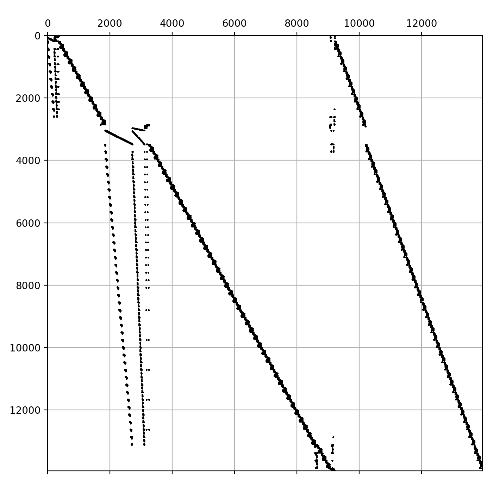

==============
Linear solvers
==============
As a sub-problem for nearly all simulation disciplines, linear systems must be solved. More specifically, the system matrix for process models in ``SigmaMu`` can reach :math:`O(10^5)` for models with large scope and/or level of detail.

.. note::

    As ``SigmaMu`` formulates most of the model via explicit relationships of properties, the system size is by about two magnitudes lower than in other equation oriented modelling tools, such as ``gPROMs`` or ``Modelica``. The explicit formulation includes the entire thermodynamic model formulation and calculation of physical properties.

    As an example, a process of 10 packed columns, where each packing is discretised into 10 slices - or 10 tray columns with 10 stages each, and the gas liquid boundary layer of each slice is discretised into 10 reactive elements, an eight-species system yields typically 10 x 10 x 10 x (8 + 2) = 10000 variables.

Typically, the sparsity of the system matrices is around 1 % to 2 %, decreasing with size, as it is rather the number of non-zero elements per row that is constant (typically 10-30) than the absolute density.

In the following, computation times are given for an *Intel Core i5-8259U × 8* CPU on *Ubuntu 24.04.4 LTS* and just to be understood indicatively.

Comparison
==========

Numpy solver
------------
The standard `numpy.linalg.solve` solver is robust for non-singular matrices, as the pivoting is solely performed to maximize numerical accuracy.
However, its computational cost is truly cubic in system size, and solving a system of size :math:`1.5\times 10^4` requires about 10 seconds. But this also means that using ``numpy`` is a robust and suitable choice for systems of size up to 10\ :sup:`3`.

Casadi solver
-------------
`CasADi`_ features high performant and efficient functionality for solving differential equation systems that come with control problems, and, as a very essential part of ``SigmaMu``, we obtain Jacobian information from the library. Within the ``SigmaMu`` solvers, we hence retrieve the system matrices as ``casadi.DM`` objects. Though it is possible to solve smaller linear systems, these are not designed to be subject to larger computations.

Scipy solver
------------
The ``scipy.sparse.linalg`` module offers ``spsolve``. To utilise this, we first must convert the ``casadi.DM`` matrix into a ``scipy.sparse.csr_matrix``, which is made easy by `CasADi`_:

.. code-block::
   :linenos:

    from scipy.sparse import csc_matrix

    dm_matrix = DM(...)  # or coming back from a casadi function
    ...
    scipy_matrix = csr_matrix(dm_matrix)

The `SciPy`_ module is capable of solving the sparse system of size :math:`1.4\times 10^4` in about 0.4 seconds, even if not not exploiting multiple CPUs in the calculation. The solver is reasonably robust for well scaled matrices, but can produce wrong solutions due to pivoting heuristics requiring to compromise between numerical precision and preservation of non-zero elements.

For application of any sparse solver, pre-scaling of the matrix to obtain near unity column and row norms is an efficient way to drastically improve robustness.

Pypardiso solver
----------------
The *Intel oneAPI Math Kernel Library PARDISO solver* is wrapped into a python package called `PyPardiso`_. Its ``spsolve`` function is compatible to the ``scipy.sparse.linalg.spsolve`` version, but exploits available cores. However, the performance for a system of size :math:`1.4\times 10^4` is by factor 2-3 inferior to that of `Scipy`_, likely due to the matrix structure and -- for the standards of sparse equation solving -- still too small to efficiently exploit multi-core algorithms. Further, the `PyPardiso`_ solver often fails to solve ``SigmaMu`` typical matrices.

Performance and comparison
--------------------------
At this point, we presented a nice graph that compared the performance of above solvers as function of system size.
The approach was to generate random, but non-singular matrices with a defined sparsity and time / apply the range of solvers.
This study (initially) surprisingly concluded with poor performance of the sparse solvers, being even slower than ``numpy.linalg.solve``.

The cause for this is that matrices with random distribution of non-zero elements yield a nearly dense decomposition and hence still require :math:`O(n^3)` complexity, while structure, even if not the nice band-structure often occurring from discretization of partial differential equations, gives a drastic advantage to sparse solvers. A typical process model structure, here for a detailed reactive column model, is shown below.

`SciPy`_ solves above mentioned system in 0.4 seconds, but requires over a minute for a random matrix of same size.

Utilized solvers
================

ScaledLinearSparseSolver
------------------------
.. autoclass:: simu.core.solver.linear.ScaledLinearSparseSolverConfig
   :members:
   :exclude-members: model_config

.. autoclass:: simu.core.solver.linear.ScaledLinearSparseSolver
   :exclude-members: __new__, __init__, reset, solve

NumpySolver
-----------
.. autoclass:: simu.core.solver.linear.NumpySolver
   :exclude-members: __new__, __init__, reset, solve
