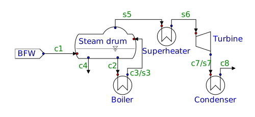

=================================================
Modelling a small steam generation with a turbine
=================================================

.. |H2O| replace:: :math:`\mathrm{H_2O}`

The process to model
====================
Let us say, we have 10 MW of heat available at a sufficiently high temperature level to produce high pressure steam. The task is to sketch a steam boiler system consisting of a boiler feed water source, a steam drum, a boiler and a superheater, as well as a condensing turbine with downstream total condensation. One interesting question is, how much mechanical power can be harvested for a given steam pressure, turbine efficiency, and achievable condenser temperature.

Stream ``c1`` is slightly subcooled boiler feed water, mixed with saturated steam and water in the steam drum, from which a condensate flow ``c2`` is extracted to the boiler and partially evaporated into return flow ``c3/s3``. A small bleed, approximately 1 % of the boiler feed water flow, is removed as stream ``c4`` to avoid accumulation of impurities that otherwise would potentially scale or corrode the boiler coils. The produced saturated steam exits as stream ``s5`` into the steam superheater, continuing as superheated stream ``s6`` into the turbine. The turbine causes partial condensation into stream ``c7/s7``, before the entire stream is condensed into the saturated condensate stream ``s8``.

We could, but do not consider the return of ``s8`` towards the boiler feed water, as this normally involves buffer tanks and initial heat exchangers, exploiting low level waste heat to raise the BFW temperature.

May the system be specified by

  - constant and specified pressure level of 100 bar upstream of the turbine
  - no pressure drop in condenser
  - given BFW feed temperature of 250 |degC|
  - The blowdown ``c4`` is 1% of the feed flow ``c1``
  - The boiler circulation yields 12 % evaporation in stream ``c3/s3``
  - Total duty in boiler and superheater is 10 MW
  - The turbine has an isentropic efficiency of 80 %
  - There is 10 % condensation in the turbine
  - Given temperature of 50 |degC| at condenser outlet ``c8``

As such, we expect the duty distribution to yield the desired condensation in the turbine, and the boiler duty to determine the BFW flow. The condenser temperature determines the turbine discharge pressure. This is hence a typical process that is still simple (and simplified), but includes a large recycle and multiple implicit specifications.

Thermodynamic models definition
===============================
The process includes steam and condensate, for which :class:`~simu.MaterialDefinition` objects need to be created. For this purpose, we first create the :class:`~simu.ThermoFrame` objects as follows:

.. exampleinclude:: steam_system/thermo.py
   :language: python
   :lines: 1-16
   :linenos:

Here, we make use of some convenience functionality:

 - The :class:`~simu.app.ThermoStructure` facilitates handling of thermodynamic model structures, but also offers static methods to create pre-defined ones, such as for the IAPWS equation of state.
 - Likewise, ``predefined_parameters`` is a :class:`~simu.ThermoParameterStore` that already includes the parameters that ship with ``SiMu``.
 - A group of :class:`~simu.ThermoContribution` classes may be called *Augmenters*, defining sets of add-on properties. A pre-defined one is :class:`~simu.app.thermo.contributions.augmenters.general.GenericProperties`, calculating among other properties enthalpy and mass flow.

In below code, the function to create the frames is called in line 23.

.. exampleinclude:: steam_system/thermo.py
   :language: python
   :lines: 19-32
   :lineno-start: 17
   :linenos:

The objects are then used as arguments to the ``_create_material`` function that attaches the model parameters and individual initial states to form the :class:`~simu.MaterialDefinition` objects. As we deal with HP steam at 100 bar as well as condensation at subatmospheric pressure, it is advisable to either define individual :class:`~simu.MaterialDefinition` objects or provide better initialisation in other ways.

Finally, we define a :class:`~simu.MaterialSpec` object for our process model material ports to express the expectancy of pure water materials.

.. important::

    The objects created from line 25 downwards can live in the global space and be imported as needed when defining the process (parts). Alternatively, we could have stored them in a data structure, but the important aspect is that no copies shall or need to be created for each application.

    This is not only due to performance reasons, but also to share a common database of thermodynamic parameters, which in other cases is essential to perform consistent fits of thermodynamic parameters.

Process model development
=========================

When building up a process model in |SigmaMu|, a good approach is to think hierarchically and in terms of reusable and encapsulated model parts. There is no considerable overhead in doing so, as the numerical process model representation is not impacted by the chosen level of granularity.

A model part does not need to represent an entire unit operation, but it can also represent a reusable aspect of it. The hierarchical modelling approach greatly reduces the development effort when scaling up the scope of a process model.

Gas liquid equilibrium
----------------------
The first module to introduce is one to constrain a steam and a condensate phase to be at equilibrium.

.. exampleinclude:: steam_system/models/vle.py
   :language: python
   :lines: 4-18
   :lineno-start: 1
   :linenos:

As the interface, the module expects two material connections, namely ``gas`` and ``liquid``, both of them being arbitrary materials. In the definition part, the model defines :math:`2+n_c` constraints, where :math:`n_c` is the number of species being in common in both phases, in our case one, being |H2O|.

.. math::
  :no-wrap:

    \begin{align*}
      T_l &= T_g\\
      p_l &= p_g\\
      \mu_{l,i} &= \mu_{g,i}\quad \text{for}\ i \in \mathcal S_l \cap \mathcal S_g
    \end{align*}

Material balance
----------------
In an equally generic manner, we can define a node that assures species conservation over a node with variable number of inlets and outlets.

As for the equilibrium module, this is an example of generic validity, and, as we will see, does not require equal species sets or any other constraints on the connected materials. The following constructor does not contain |SigmaMu| specific code:

.. exampleinclude:: steam_system/models/species_balance.py
   :language: python
   :lines: 4-11
   :lineno-start: 1
   :linenos:

All it does is to store attributes for later use, namely the number of inlet and outlet ports to be defined, as well as the tolerance unit for the molar flows. Regarding the latter, ``kmol/h`` is a suitable choice for industrially sized processes, but for modelling of laboratory-scale equipment, ``mol/h`` or ``mmol/s`` might be a better choice.

The following generators are used to produce the port names as ``in_01``, ``in_02`` etc. and likewise ``out_01``, ``out_02`` etc:

.. exampleinclude:: steam_system/models/species_balance.py
   :language: python
   :lines: 27-33
   :lineno-start: 24
   :linenos:

Hence nothing magic is going on here either. Next, we define the interface of the model:

.. exampleinclude:: steam_system/models/species_balance.py
   :language: python
   :lines: 13-17
   :lineno-start: 10
   :linenos:

This interface simply defines the ports for all input and output ports. Note again that |SigmaMu| does not support the notion of port direction inherently, as it often does not apply, but is rather an implementation detail of the individual models.

Keeping the best for last, the actual definition of the model:

.. exampleinclude:: steam_system/models/species_balance.py
   :language: python
   :lines: 19-25
   :lineno-start: 16
   :linenos:

While line 17 and 18 simply collect the connected material objects, the actual calculation happens in line 20: The mole vectors ``m["n"]`` are of type :class:`~simu.QuantityDict` and thus define the ``+`` operator and can be used as arguments to the ``sum`` function. When adding two :class:`~simu.QuantityDict` objects, non-existing keys are treated as zero, such that the result object contains the union of both species sets. ``d_n`` is therefore the residual of molar flows for all involved species.

Lines 21-22 then define the constraints to force these residuals to zero, applying the before mentioned tolerance unit.

Boiler
------
At this point, we can start to define simple unit operations, one of them being the boiler. For simplicity, the model is implemented specifically for the intended purpose without generalisation. As such, we specify zero pressure drop and the fraction of water being evaporated, while the duty is not locked, but only reported as a property. The class head and interface then looks as follows:

.. exampleinclude:: steam_system/models/heat_exchanger.py
   :language: python
   :lines: 4-17
   :lineno-start: 1
   :linenos:

Here, the (condensate) feed and steam and condensate outlet are defined as material ports. Further, the parameter ``vap_frac`` is declared to represent the vapour fraction, and the ``duty`` parameter to export the unit's heat duty. The model definition is

.. exampleinclude:: steam_system/models/heat_exchanger.py
   :language: python
   :lines: 19-31
   :lineno-start: 16
   :linenos:

Here, line 18 constraints the steam outlet pressure to be the steam pressure. No pressure constraint is explicitly given for the condensate outlet, as this is covered by the ``VLE`` sub-model. First the above developed ``MaterialBalance`` model is utilised in lines 20-21 to conserve the total amount of water, then the ``VLE`` model, included in lines 23-24, assures phase equilibrium.

Line 27 specifies the vapour fraction, whereas a little trick is applied. Two alternatives to define these residuals are

.. math::

    \frac{\dot n_s}{\dot n_f} - \beta^\mathrm{spec} = 0 \quad\text{or}\quad
    \dot n_s - \beta^\mathrm{spec}\cdot \dot n_f = 0

While the first form may be more intuitive, the second form is linear in :math:`\dot n_i`, which might have a slight positive effect on solver convergence, and is as such a good habbit. Line 28 defines the duty as the difference in enthalpies.

Superheater
-----------
As the superheater only deals with one-phase flow, its definition is ridiculously simple and needs no further explanation beyond what is already valid for the boiler above:

.. exampleinclude:: steam_system/models/heat_exchanger.py
   :language: python
   :lines: 34-47
   :lineno-start: 31
   :linenos:

TotalCondenser
--------------
While the superheater was simple, we might learn a thing about thermodynamics on this one, as the task is to receive a partially condensed flow, and bring it down to its exact boiling point. We could be pragmatic and define steam and condensate flows as both inlets and outlets, and so specify the vapour fraction to be small. If there were inert gases present and vacuum ejectors installed, the approach were entirely suitable, but here we stubbornly obliged ourselves to implement total condensation.

To do this, we need a *trial gas phase* that does not enter the material balance, but stands in phase equilibrium with the actual outlet stream. The size of the trial gas phase is arbitrary, represented by the ``_trial_phase_size`` parameter in below definition:

.. exampleinclude:: steam_system/models/heat_exchanger.py
   :language: python
   :lines: 50-58
   :lineno-start: 47
   :linenos:

Further, a parameter is defined for the desired temperature, which will via the boiling point fix the pressure level. We also announce to calculate the duty of the unit.

.. exampleinclude:: steam_system/models/heat_exchanger.py
   :language: python
   :lines: 60-74
   :lineno-start: 57
   :linenos:

Here, line 59 creates the trial gas phase. Instead of giving a concrete :class:`~simu.MaterialDefinition` object from among the ones defined in above section on thermodynamic models, we just use the definition given for the inlet steam, thereby making our model capable of dealing with other feeds, such as steam with minor amounts of inert gases.

In line 64-66, the outlet steam is brought to equilibrium with our trial phase, and the trial phase size is set. This will provide in total 4 equations, one more than the degrees of freedom introduced with the trial phase. The result is the link between temperature and pressure by the boiling point.

The remaining part contains nothing new. The temperature is set to the specified value, and pressure drop is defined as zero. This means however that the upstream unit (the turbine) cannot also specify its discharge pressure, as it is now fixed to the boiling point at 50 |degC|.

Steam Turbine
-------------
This is the last thermodynamic lecture for today -- covering entropy and isentropic efficiency. The isentropic expansion is the process described by reducing the pressure of the flow at constant entropy:

.. math:: \dot H^\mathrm{out}_\mathrm{rev} = \dot H(S^\mathrm{in}, p^\mathrm{out}, \dot{\vec n})

Thanks to the canonical formulation of our thermodynamic models, there is not more to it, and we do not need to start juggling adiabatic exponents and ideal gas approximations. The reversible (maximal reachable) work extraction is then simply

.. math:: \dot W_\mathrm{rev} = \dot H^\mathrm{in} - \dot H^\mathrm{out}_\mathrm{rev}

From here, the actual outlet enthalpy computes by removing the actual work, defined by the isentropic efficiency :math:`\eta_s`, from the inlet enthalpy:

.. math::

    \dot H^\mathrm{out} = H^\mathrm{in} - \dot W \quad\text{with}\quad
    \dot W = \eta_s\,\dot W_\mathrm{rev}

The only complication here is the condensing operation, requiring to calculate all output enthalpies (reversible and actual) as the sum of liquid and gas enthalpy.

Steam drum
----------

Overall process model
---------------------

Degree of freedom analysis
==========================

